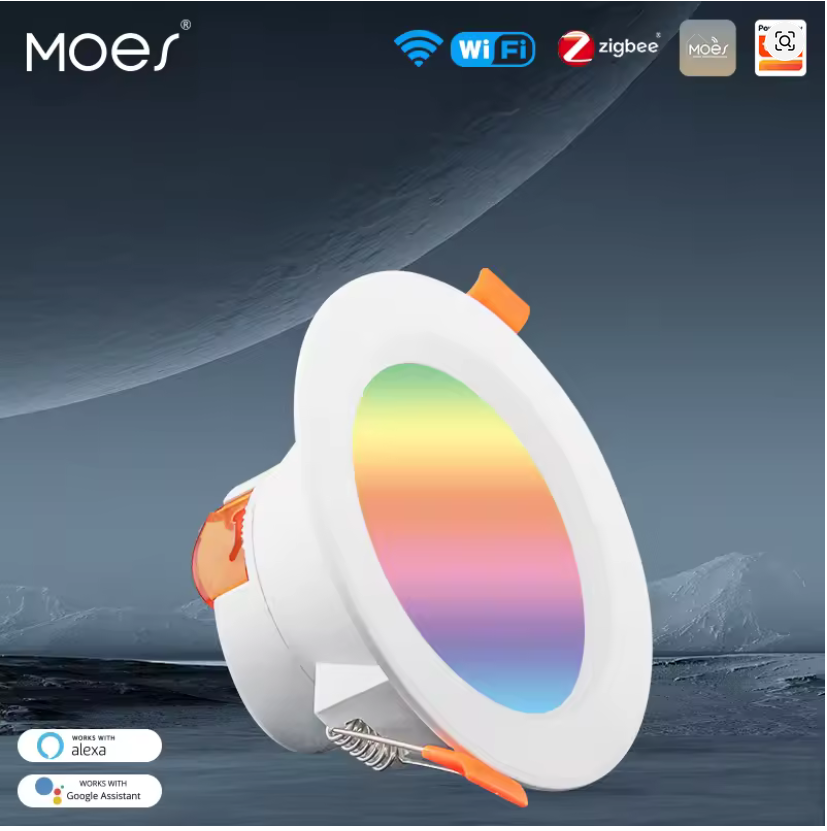
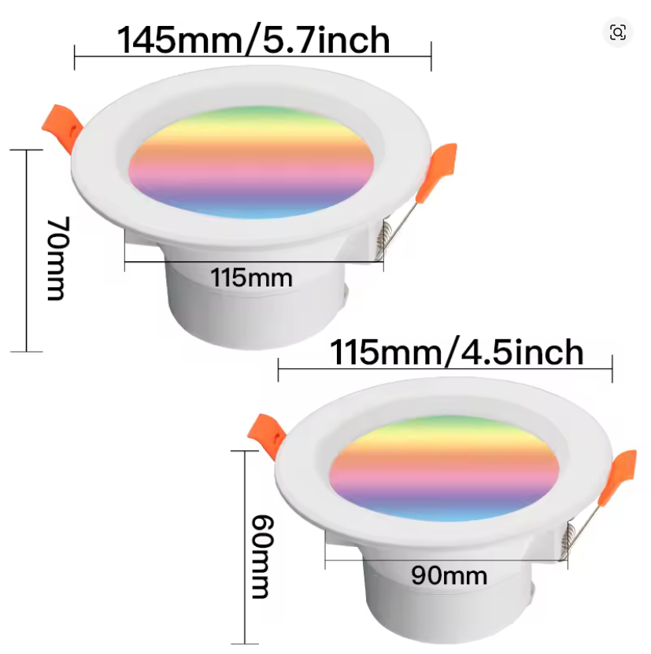
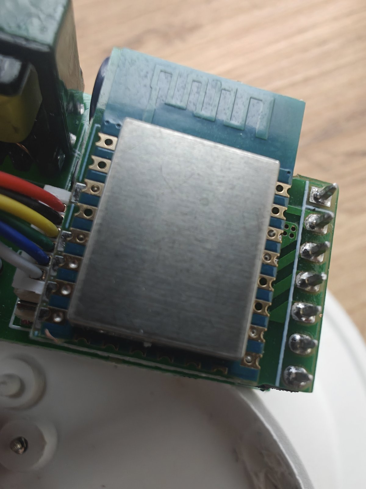
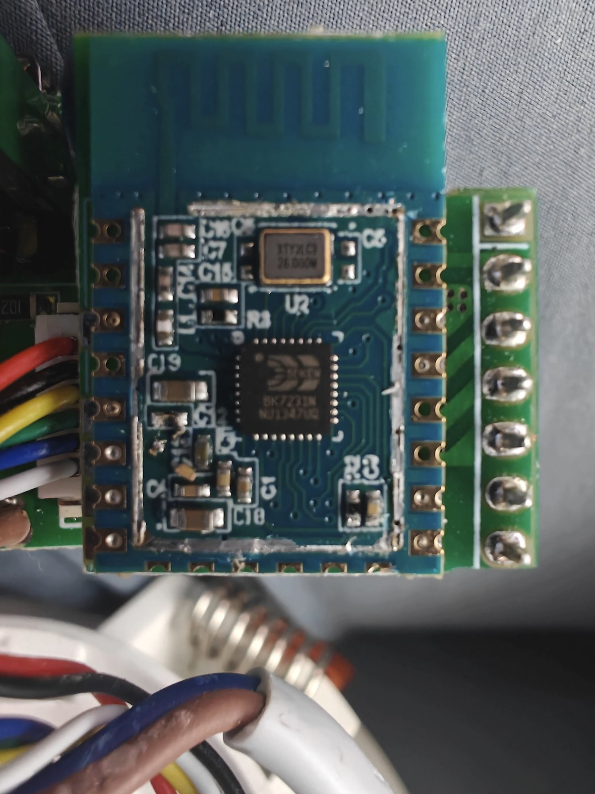
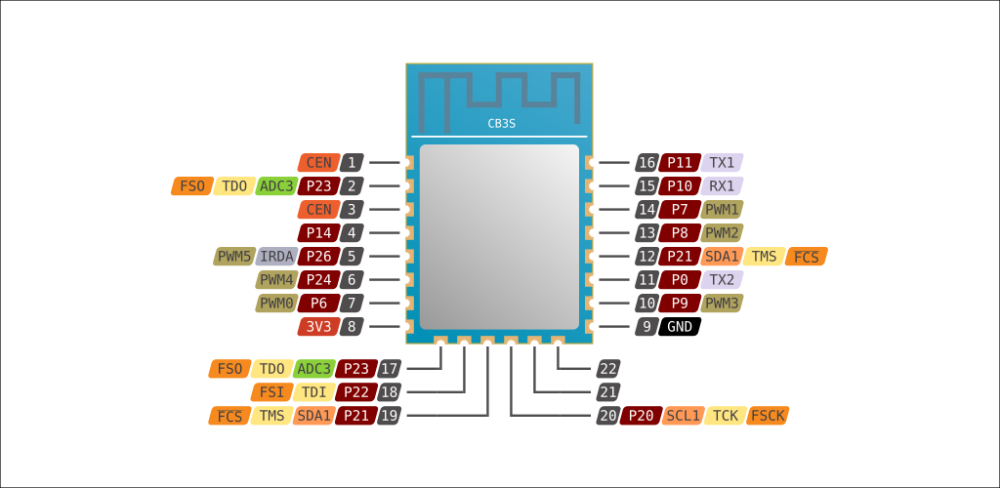
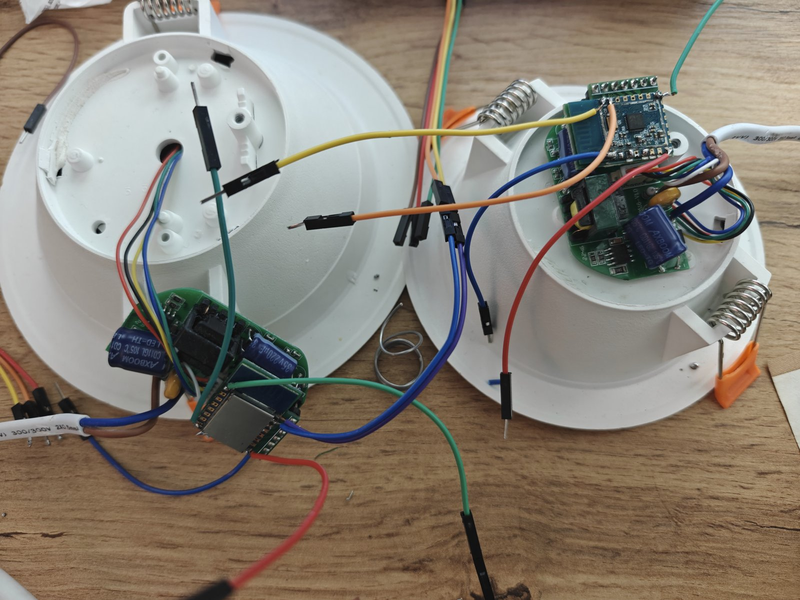
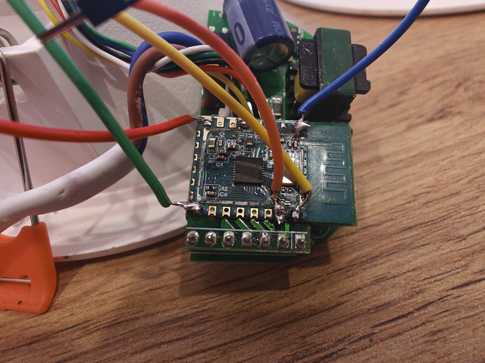

# Tuya CB3S RGBWW Downlight — ESPHome

> How two downlights bought by mistake, after a season forgotten in a wardrobe, ended up running ESPHome.

## The story

I bought several units of this Moes RGBWW downlight in its **Zigbee** version… and by mistake, two of them turned out to be the **WiFi** version. Installing Tuya devices that depend on some unknown third-party cloud is not an option for me, so both units went straight into a wardrobe.

Some time later I picked the project back up. The LEDs are really good quality, and it felt like a waste to simply not use them — or to install them as dumb on-off lights and lose the whole color range they offer. They deserved to be set free.

|  |  |
|---|---|
| *The downlight as received from the store* | *It comes in two sizes: 145 mm and 115 mm* |

### First problem: what chip is this?

Neither the enclosure nor the PCB had the chip name printed anywhere. Nothing. Just a module hiding under a metal shield:

|  |
|---|
| *The module with its shield on: no way to know what's underneath* |

So there was no choice but to pry off the metal shield to find out which chip it was: a **Beken BK7231N**. Then, thanks to the **LibreTiny** documentation, I was able to verify the pinout and identify the module as a **Tuya CB3S**: https://docs.libretiny.eu/boards/cb3s/

|  |
|---|
| *Shield removed: the Beken BK7231N finally visible* |



*CB3S pinout diagram, taken from the LibreTiny documentation.*

### Bekens are not ESPs

With those obstacles behind me, the "hard" work was done. Or so I thought. Beken chips are a bit different from ESPs, and there are a few things to keep in mind:

1. **The CEN bridge**: you must locate the CEN pin and bridge it to GND before powering the chip… but remove the bridge before the actual writing starts.
2. **Stable 3.3 V supply**: the chip needs a rock-solid 3.3 V supply. If your USB adapter can't provide it, flashing will fail. You can power it from an external 3.3 V supply or plug the downlight itself into mains. **WARNING if you do the latter: make sure the USB adapter's power line is NOT connected. Only GND, RX and TX go to the USB-UART adapter.**
3. **The order that worked for me**: power up the board, plug in the USB adapter, launch the flash command, wait a few seconds, then remove the CEN-to-GND bridge.

A breadboard helps a lot with this kind of juggling. I'm neither an electronics nor an IT expert, so all of this is beginner work… but what matters is reaching the goal.

Since I had downlights of both sizes, I can confirm that **both use the same board and the same software**.

|  |  |
|---|---|
| *Both downlight sizes wired up for flashing* | *Wires soldered to the CB3S UART pads (GND, RX, TX)* |

### The color puzzle

With the module finally flashed, I tried a "generic" RGB light firmware. It didn't work on the first try: the light got stuck in red because the PWM pins didn't match. There was no exact YAML for this downlight anywhere, so I had to try every pin and combination: I flashed a diagnostic firmware with one monochromatic light per candidate pin, toggled them one by one and wrote down which color actually lit up. Tedious, but it worked. The YAML in this repo is the result and **works 100% with this device**.

The correct pinout for my unit is:

| Function | Pin |
|----------|-----|
| Red      | P8  |
| Green    | P24 |
| Blue     | P26 |
| Cold white | P7 |
| Warm white | P6 |
| Touch button | P14 |

(Mind you: Beken pins are named `P6`, `P7`, `P8`…, not `GPIOxx`.)

## Hardware

- Tuya CB3S module (Beken BK7231N)
- 220 V mains powered LED driver
- RGB + cold/warm white LEDs
- Capacitive touch button on the front cover
- Available in two sizes (145 mm and 115 mm); same board, same firmware

## Wiring for flashing

Solder thin wires to the CB3S UART pads: **GND, RX (P10) and TX (P11)** going to your USB-to-UART adapter, plus a temporary bridge between **CEN and GND** (a breadboard helps a lot here).

- **Recommended**: power the downlight board itself from mains (its onboard supply is rock solid). In that case, **do NOT connect the 3V3 line of the USB adapter — only GND, RX and TX.**
- Alternative: power the chip from an external 3.3 V supply rated for at least 500 mA. The 3V3 pin of most USB adapters can't handle the Wi-Fi current spikes and flashing will fail.

**WARNING: you are working with mains voltage. Double-check your wiring before plugging anything in, and never touch the board while it is powered.**

The wiring detail photo above (image6) shows exactly what this looks like.

## Backing up the stock firmware (highly recommended)

Before flashing anything, dump the original Tuya firmware. It only takes a few minutes and it is your ticket back: with this file you can restore the downlight to its factory state at any time.

The sequence that works (order matters):

1. Board **powered off**.
2. Bridge **CEN to GND**.
3. Plug in the USB adapter (GND/RX/TX only).
4. Launch the read command:
   ```bash
   ltchiptool flash read bk7231n moes-downlight-backup.bin -d /dev/ttyUSB0
   ```
5. **Power up the board.**
6. **Remove the CEN-to-GND bridge.**
7. Wait for the dump to finish. The backup must be exactly **2 MiB** (2097152 bytes).

Keep that file somewhere safe.

This repo already includes my own stock dump: `firmware/moes-downlight-cb3s-stock.bin` (sanitized — the Tuya config block holding my Wi-Fi credentials was wiped, so a restored unit will boot stock but unpaired). It should work on any unit of this downlight, but **dumping your own is still recommended**.

### Restoring the stock firmware

If you ever want to go back to Tuya, write the backup back with the same wiring and the same power-up sequence:

```bash
ltchiptool flash write moes-downlight-backup.bin -d /dev/ttyUSB0
```

## Flashing ESPHome

1. Copy `downlight-cb3s-rgbww.yaml` to your ESPHome config folder.
2. Set your Wi-Fi credentials in `secrets.yaml` (`wifi_ssid` / `wifi_password`).
3. Compile the firmware:
   ```bash
   esphome compile downlight-cb3s-rgbww.yaml
   ```
   The `.uf2` file ends up in `.esphome/build/<node-name>/.pioenvs/<node-name>/firmware.uf2`.
4. Flash it with the same wiring and the same power-up sequence as the backup:
   ```bash
   ltchiptool flash write firmware.uf2 -d /dev/ttyUSB0
   ```
5. On first boot the downlight connects to your Wi-Fi. If it can't, it falls back to its own AP with a captive portal so you can reconfigure it.

## OTA updates

The wired flash is only needed once. From then on, update over the air from the ESPHome dashboard or with:

```bash
esphome run downlight-cb3s-rgbww.yaml
```

## Troubleshooting

- **`flash read` works but `flash write` dies at the first sector (`0x11000`, "No response received")**: almost always insufficient 3.3 V power from the USB adapter. Power the board itself and connect only GND/RX/TX. Lowering the baud rate won't fix this.
- **`Timeout attempting to link with chip`**: the chip is not in download mode. Check the CEN-to-GND bridge and repeat the power-up sequence; timing matters.
- **Unstable reads/writes**: use short wires, solid connections (solder, don't rely on loose dupont cables) and a decent USB-UART adapter.
- **No Wi-Fi after flashing**: the config includes a fallback AP with captive portal — connect to it and re-enter your credentials. Also make sure your `secrets.yaml` was next to the YAML when compiling.
- **Colors don't match on your unit**: use the diagnostic approach described above — one monochromatic light per candidate PWM pin (`P6`, `P7`, `P8`, `P24`, `P26`), toggle them one by one and note which color actually lights up.

## Files

- `downlight-cb3s-rgbww.yaml` — complete ESPHome configuration example.
- `esphome-device/config.yaml` — hardware-only config for the ESPHome devices site.
- `esphome-device/index.md` — device page for the ESPHome devices site.
- `cb3s.svg` — CB3S pinout diagram (LibreTiny).

## License

AGPL-3.0 — use at your own risk, especially when working with mains voltage.

## Acknowledgements

- [LibreTiny](https://docs.libretiny.eu/) for the CB3S/BK72xx platform and documentation. Without the CB3S page I would have been completely lost.
- The ESPHome community for making local smart home possible.
- Patience. Lots of it.

---

[Versión en castellano](README.es.md)
